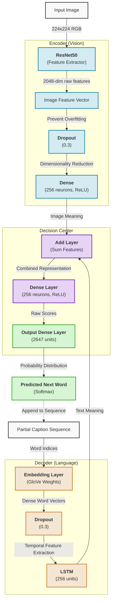

# Neural Image Captioning Architecture

This diagram illustrates the typical encoder-decoder architecture used in your image captioning model, which processes both the image (using a CNN) and the text sequences (using an RNN/LSTM).

### Detailed Layer Explanations

| Layer | Function | Why we use it? |
| :--- | :--- | :--- |
| **ResNet50** | Feature Extractor | Uses pre-trained knowledge to "see" objects, shapes, and textures in the image. |
| **Dropout** | Randomly deactivates neurons | Prevents the model from memorizing the training data (Overfitting). |
| **Dense (Image)** | Compresses 2048 to 256 | Simplifies the huge ResNet output into a manageable size that matches the LSTM. |
| **Embedding** | Maps words to 50D vectors | Converts abstract word IDs into "coordinate points" where similar words (e.g., 'dog' and 'cat') are close together. |
| **LSTM** | Long Short-Term Memory | Remembers the order of words and understands the context of the sentence so far. |
| **Add Layer** | Merges Vision + Text | This is where the model finally "looks" at the image while "thinking" about the current sentence. |
| **Dense (256)** | Feature Refiner | Learns how to interpret the merged image and text features together. |
| **Softmax (Output)** | Probability Calculator | Converts math scores into percentages (e.g., "There is a 90% chance the next word is 'running'"). |
| **The Loop** | Iterative Generation | Because the model only predicts **one word at a time**, it must feed its own output back into the input until the sentence is finished. |
