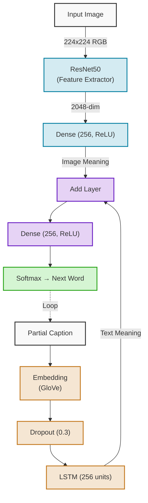
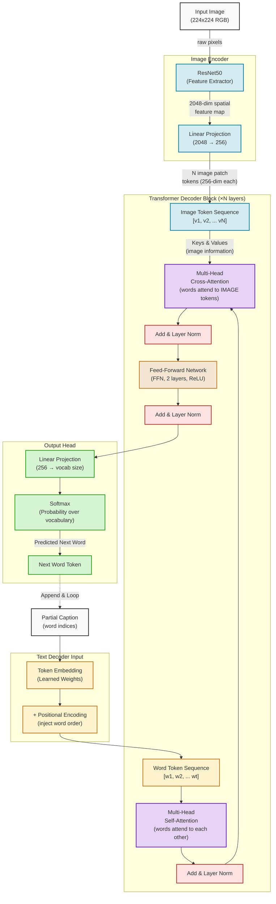

# Transformer-Based Image Captioning Architecture

Comparison of your current ResNet50+LSTM model vs the Transformer upgrade.

---

## ✅ Your Current Model (ResNet50 + LSTM)



---

## 🚀 Transformer Version (Upgraded)



---

## 🔍 Key New Components Explained

| New Component | Replaces | What It Does |
| :--- | :--- | :--- |
| **Linear Projection (Image)** | Dense (Image) | Projects ResNet features into token format usable by the Transformer |
| **Positional Encoding** | *(nothing — LSTM handled order implicitly)* | Injects word position info since Transformer has no built-in memory |
| **Multi-Head Self-Attention** | LSTM | Each word looks at ALL other words at the same time to understand context |
| **Multi-Head Cross-Attention** | Add Layer | Each word dynamically decides which image regions to focus on |
| **Feed-Forward Network (FFN)** | Dense (256, ReLU) | Refines the combined image+text representation per token |
| **Add & Layer Norm** | *(nothing in LSTM model)* | Stabilizes training, prevents vanishing gradients |

---

## 🧠 Why Cross-Attention is the Game-Changer

```
Your Add Layer (current):
   Image vector (one fixed 256-dim) + LSTM state = combined
   ↳ Image contributes EQUALLY to every word prediction

Cross-Attention (Transformer):
   Generating "dog"    → attends to animal/fur regions of image  🐕
   Generating "park"   → attends to grass/tree regions of image  🌳
   Generating "runs"   → attends to motion/legs regions of image 🏃
   ↳ Each word DYNAMICALLY picks what to look at in the image
```

---

## ⚖️ Side-by-Side Summary

| Aspect | ResNet50 + LSTM (Yours) | Transformer |
|---|---|---|
| **Image encoding** | ResNet → Dense → single vector | ResNet → Projection → sequence of tokens |
| **Text encoding** | LSTM (sequential) | Self-Attention (parallel) |
| **Image-text fusion** | Simple Add | Cross-Attention (dynamic, per-word) |
| **Word order handling** | LSTM memory (implicit) | Positional Encoding (explicit) |
| **Training** | Sequential, slower | Parallel, faster |
| **Caption quality** | Good | Better for long/complex captions |
| **Hardware** | T4 Colab ✅ | T4 Colab ⚠️ (use small N layers) |
